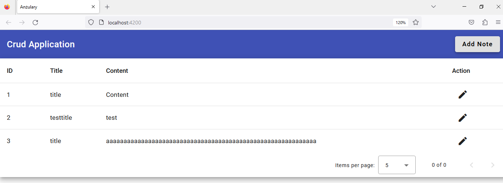
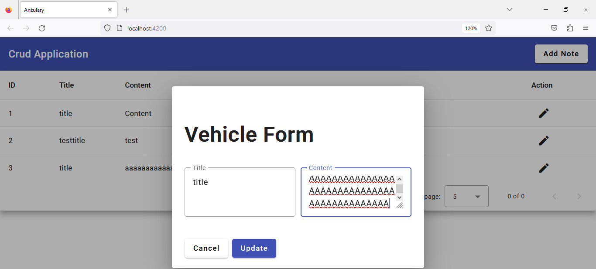

# Ksb2MvcDomoweAngular

Moduł 8: Napisz Notatnik online – aplikacje z interfejsem graficznym, która umożliwia na tworzenie notatek, zapisywanie ich w bazie danych, późniejszą edycję, oraz wyświetlanie.

